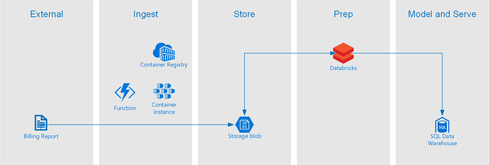

# Azure Billing Repots

The `azure billing reports` are an unofficial collection of reports built on top of the Azure Billing API.

Azure provides an hourly usage report for their customers. The `azure billing reports` use a script to fetch the data and use PowerBI M queries to parse the data info useful fields.

This repository has:

- Scripts to fetch billing related information
- Modern Data Warehouse Architecture for Cost Optimization

# Overview




## Billing Scripts - Getting Started

- First obtain your enrollment id and a valid api authentication key.
- Run the `/scripts/get_usage_data.py` script to get the latest billing usage data. This will download and save the billing data into a csv file.
- Run the `/scripts/get_ri_recommendations.py` script to get the latest reserved instance recommendations.

```bash
python get_usage_data.py enrollment_id api_auth_key
python get_ri_recommendations.py enrollment_id api_auth_key
python get_price_list.py enrollment_id api_auth_key
```

- Open the AzureBillingViaCsv.pbit template file
- Provide the full path to the downloaded csv file.

## Building and Deploying


```bash
# Build docker image
docker build --pull --rm -f "Dockerfile.dev" -t azurebillingreports:latest "."

# Run docker image
docker run --rm -it --env-file local.env azurebillingreports:latest

# If you want to see STDOUT use
docker run --rm -a STDOUT --env-file local.env azurebillingreports:latest

# Deploy the image to repository. Replace the name <registryname> with the name of your repository. After deploying, this will remove the image from your local Docker environment
az acr login --name  <registryname>
docker tag azurebillingreports <registryname>.azurecr.io/azurebillingreports:v1
docker push <registryname>.azurecr.io/azurebillingreports:v1
docker rmi <registryname>.azurecr.io/azurebillingreports:v1

# Create a container instance with the following:
az container create --resource-group blxbilling --name blxcontainergroup --image blxcontainerregistry.azurecr.io/azurebillingreports:v1 --registry-login-server blxcontainerregistry.azurecr.io --registry-username <acr_username> --registry-password <acr_password> --secure-environment-variables ENROLLMENT_ID=<enrollment_id> BILLING_AUTH_KEY=<billing_auth_key> STORAGE_CONTAINER_NAME=<billingfiles> STORAGE_CONNECTION_STRING=<connection_string> --restart-policy Never

# Deploy with yaml
az container create --resource-group blxbilling --file billing-container.yaml

# Delete instance
az container delete --resource-group blxbilling --name blxcontainergroup
```

## Update Container Environment Variables

```bash
# Export the container settings
az container export -g blxbilling --name blxcontainergroup -f output.yaml

# Edit the settings and recreate
az container create -g blxbilling -f output.yaml

# Reset Service Principal credentials
az ad sp credential reset --name name-of-service-principal
```

## Create Docker Image repository

```bash
az acr create --resource-group myResourceGroup --name myContainerRegistry007 --sku Basic
```

# Configure Databricks

Azure Databricks is used during the prep phase of the data pipeline.

## Configure Secrets

The notebook uses secrets to connect to the storage account. Use the databricsk cli to set a secrets

```bash
# Create a secret scope for premium cluster
databricks secrets create-scope --scope billing

# Or Create secret scope for standard cluster
databricks secrets create-scope --scope billing --initial-manage-principal users

# Add secrets to cluster
databricks secrets put --scope billing --key storage_key
databricks secrets put --scope billing --key db_connection
databricks secrets put --scope billing --key db_username
databricks secrets put --scope billing --key db_password
```

# Common Issues

- Request date header too old: 'Mon, 16 Dec 2019 22:00:09 GMT'
    - The docker image time has drifted. Restart docker on host container.
- API Key Expired
    - update the key found in secure environment variables


# Development

You'll need to set up a development environment if you want to develop a new feature or fix issues. The project uses a docker based devcontainer to ensure a consistent development environment.

- Open the project in VSCode and it will prompt you to open the project in a devcontainer. This will have all the required tools installed and configured.

## Setup local dev environment

If you use the devcontainer image you need to log into the Container registry

```bash
# load .env vars (optional)
[ -f .env ] && while IFS= read -r line; do [[ $line =~ ^[^#]*= ]] && eval "export $line"; done < .env

az login --use-device-code --tenant "$AZURE_TENANT_ID"
az acr login --name $REGISTRY_LOGIN_SERVER
```

If you want to develop outside of a docker devcontainer you can use the following commands to setup your environment.

```bash
# Configure the environment variables. Copy example.env to .env and update the values
cp example.env .env

# load .env vars
# [ ! -f .env ] || export $(grep -v '^#' .env | xargs)
# or this version allows variable substitution and quoted long values
# [ -f .env ] && while IFS= read -r line; do [[ $line =~ ^[^#]*= ]] && eval "export $line"; done < .env

# Create and activate a python virtual environment
# Windows
# virtualenv \path\to\.venv -p path\to\specific_version_python.exe
# C:\Users\!Admin\AppData\Local\Programs\Python\Python312\python.exe -m venv .venv
# .venv\scripts\activate

# Linux
# virtualenv .venv /usr/local/bin/python3.12
# python3.12 -m venv .venv
# python3 -m venv .venv
python3 -m venv .venv
source .venv/bin/activate

# Update pip
python -m pip install --upgrade pip

# Install dependencies
pip install -r requirements_dev.txt

# Configure linting and formatting tools
sudo apt-get update
sudo apt-get install -y shellcheck
pre-commit install

# Install the package locally
pip install --editable .
```

## Style Guidelines

This project enforces quite strict [PEP8](https://www.python.org/dev/peps/pep-0008/) and [PEP257 (Docstring Conventions)](https://www.python.org/dev/peps/pep-0257/) compliance on all code submitted.

We use [Black](https://github.com/psf/black) for uncompromised code formatting.

Summary of the most relevant points:

- Comments should be full sentences and end with a period.
- [Imports](https://www.python.org/dev/peps/pep-0008/#imports) should be ordered.
- Constants and the content of lists and dictionaries should be in alphabetical order.
- It is advisable to adjust IDE or editor settings to match those requirements.

### Use new style string formatting

Prefer [`f-strings`](https://docs.python.org/3/reference/lexical_analysis.html#f-strings) over `%` or `str.format`.

```python
# New
f"{some_value} {some_other_value}"
# Old, wrong
"{} {}".format("New", "style")
"%s %s" % ("Old", "style")
```

One exception is for logging which uses the percentage formatting. This is to avoid formatting the log message when it is suppressed.

```python
_LOGGER.info("Can't connect to the webservice %s at %s", string1, string2)
```

### Testing

Ideally, all code is checked to verify the following:

All the unit tests pass All code passes the checks from the linting tools To run the linters, run the following commands:

```bash
# Use pre-commit scripts to run all linting
pre-commit run --all-files

# Run a specific linter via pre-commit
pre-commit run --all-files codespell

# Run linters outside of pre-commit
codespell .
shellcheck -x ./script/*.sh
```

# References

- https://docs.microsoft.com/en-us/azure/container-instances/container-instances-using-azure-container-registry
- Databricks secrets https://docs.databricks.com/security/secrets/secrets.html
