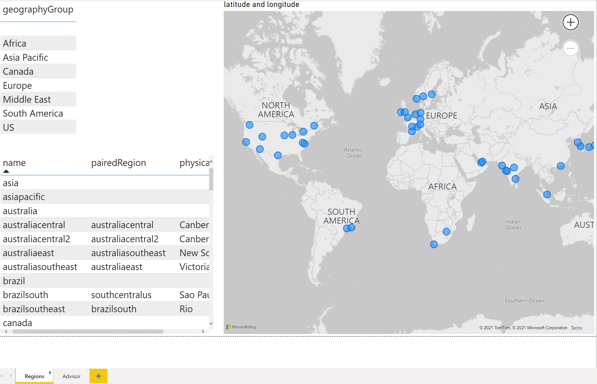
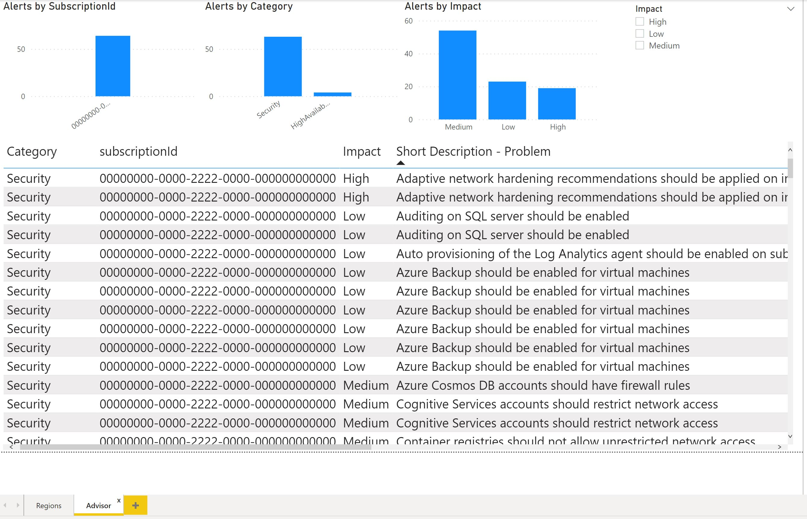
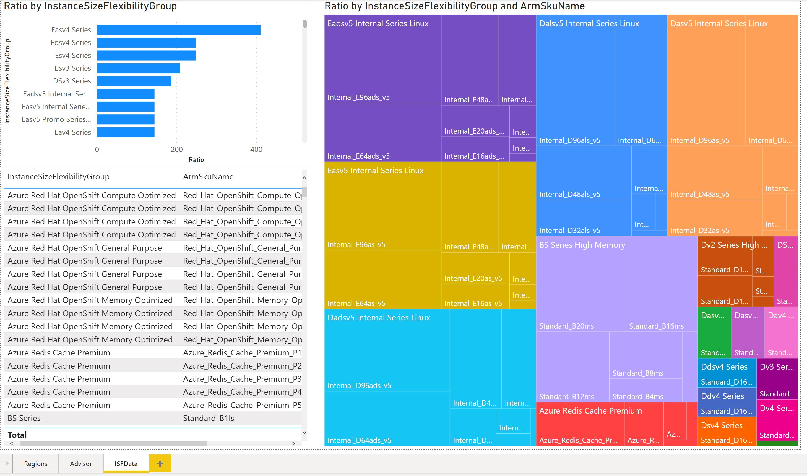
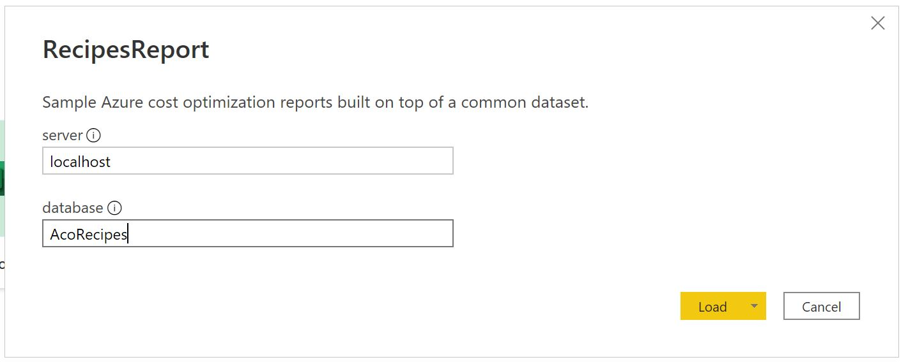
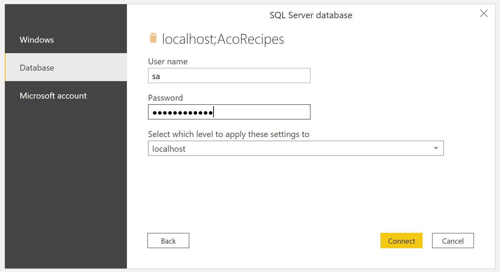

# Azure Cost Optimization Recipes

Azure Cost Optimization Recipes is a collection of reports built on top of a common dataset.

The Recipes include:

- Sample Reports
- Common Data Sets
- Development Environment

> ## Quick Start
> Jump to the [Quick Start](#QuickStart) to start looking at the sample recipe reports

# Sample Reports

Create a new report using the common data set using the development environment. 

- Start the local Sql Database docker image
- Open the `RecipesReport.pbit` template
- Point to the Database

# Common Data Set

The purpose of the Common Data Set is to standardize on the various data sets used to create meaningful reports for Azure Cost Optimzation and to provide a sample database for local development.

|Table | Source | Fields | Sorted | Typed |
|------|--------|--------|-------|--------|
| Regions | Blob - download/regions/azure regionsv2.json | Yes | Yes | No |
| Advisor | Blob - download/advisor/merged/advisor.json| Yes | Yes | No |
| ISFData | Blob - download/isfratio/isfratio.csv | Yes | Yes | Yes |
| Reservation Transactions | Blob - download/restransactions/restransactions.json | Yes | Yes | No |
| ActualCost | DB | Yes | No (OK) | Yes |
| AmortizedCost | DB | Yes | No (OK) | Yes |
| Reservation Details | DB |Yes | Yes | Yes |
| Subscriptions | Billing data | NA | NA | NA |
| Reservation Recommendations | blob - download/resrecommendations/merged/reservation_merged.json| Yes | Yes | No |
| Meters | Reservation Recommendations | NA | NA | NA |
| PriceList | Blob - download/pricesheet/pricesheet.json | Yes | Yes | No |
| Marketplace | Blob - download/marketplace/marketplace.json |  Yes | Yes | No |
| Date | Calculated | NA | NA | NA |

## Relationships

| Table Left | Table Right | Cardinality | Cross Filter |
| -----------|-------------|-------------|--------------|
| ActualCosts.Date | Date.DateAsTextAlt | Many to one | Both |
| ActualCost.MeterId | Meters.meterId | Many to one | Single |
| ActualCost.ResourceLocation | Regions.name | Many to one | Single |
| ActualCosts.SubscriptonId | Subscriptions.SubscriptionId | Many to one | Single |
| AmortizedCost.Date | Date.DateAsTextAlt | Many to one | Single |
| AmortizedCost.ResourceLocation | Regions.name | Many to one | Single |
| AmortizedCost.SubscriptionId | Subscriptions.SubscriptionId | Many to one | Single |
| Reservation Recomendatins.subscriptionId | Subscriptions.SubscriptionId | Many to one | Single |

## Regions Table



| Field | Type | Notes |
|-------|------|-------|
| displayName | nvarchar(25) | |
| geographyGroup | nvarchar(20) NULL | |
| id | nvarchar(100) | |
| latitude | Decimal(8,6) NULL | |
| longitude | Decimal(9,6) NULL | |
| name | nvarchar(25) | |
| pairedRegion | nvarchar(25) NULL | |
| physicalLocation | nvarchar(35) NULL | |
| regionCategory | nvarchar(15) | | 
| regionalDisplayName | nvarchar(50) | |
| regionType | nvarchar(10) | |
| subscriptionId | nvarchar(50) | |

Example Data. See full dataset [/sampledata/Regions.csv](sampledata/Regions.csv)

|displayName | geographyGroup | id | latitude | longitude | name | pairedRegion | physicalLocation | regionCategory | regionalDisplayName | regionType | subscriptionId |
|------------|-----|----|-----|-----|-----|-----|-----|-----|-----|-----|-----|
| Asia |  | /subscriptions/cd3b4810-bb97-4f99-9eaa-20c547ee30cb/locations/asia |  |  | asia |  |  | Other | Asia | Logical | cd3b4810-bb97-4f99-9eaa-20c547ee30cb |
| Australia Central | Asia Pacific | /subscriptions/cd3b4810-bb97-4f99-9eaa-20c547ee30cb/locations/australiacentral | -35.3075 | 149.1244 | australiacentral | australiacentral | Canberra | Other | (Asia Pacific) Australia Central | Physical | cd3b4810-bb97-4f99-9eaa-20c547ee30cb |
| Brazil |  | /subscriptions/cd3b4810-bb97-4f99-9eaa-20c547ee30cb/locations/brazil |  |  | brazil |  |  | Other | Brazil | Logical | cd3b4810-bb97-4f99-9eaa-20c547ee30cb |
| Brazil Southeast | South America | /subscriptions/cd3b4810-bb97-4f99-9eaa-20c547ee30cb/locations/brazilsoutheast | -22.90278 | -43.2075 | brazilsoutheast | brazilsouth | Rio | Other | (South America) Brazil Southeast | Physical | cd3b4810-bb97-4f99-9eaa-20c547ee30cb |
| Central US | US | /subscriptions/cd3b4810-bb97-4f99-9eaa-20c547ee30cb/locations/centralus | 41.5908 | -93.6208 | centralus | eastus2 | Iowa | Recommended | (US) Central US | Physical | cd3b4810-bb97-4f99-9eaa-20c547ee30cb |
| Central US (Stage) | US | /subscriptions/cd3b4810-bb97-4f99-9eaa-20c547ee30cb/locations/centralusstage |  |  | centralusstage |  |  | Other | (US) Central US (Stage) | Logical | cd3b4810-bb97-4f99-9eaa-20c547ee30cb |
| Central US EUAP | US | /subscriptions/cd3b4810-bb97-4f99-9eaa-20c547ee30cb/locations/centraluseuap | 41.5908 | -93.6208 | centraluseuap | eastus2euap |  | Other | (US) Central US EUAP | Physical | cd3b4810-bb97-4f99-9eaa-20c547ee30cb |

### Steps to Create Sample data

- Download from Azure
- Transform the data
- Remove Bad Records

Download the data using the [list-locations](https://docs.microsoft.com/en-us/rest/api/resources/subscriptions/list-locations#code-try-0) api with either the `az cli` or `wget`.

```bash
# Replace with your subscription-id and bearer token
subscription_id=<subscription-id>
bearer_token=<bearer token>
regions_filename=AzureLocations.json

# az cli example
az account list-locations > $regions_filename

# wget example
header='--header=Authorization: Bearer $bearer_token'
wget "$header" https://management.azure.com/subscriptions/$subscription_id/locations?api-version=2020-01-01 -O $regions_filename
```

Transform the data using the PowerBi Template.

- Open the `sampledata/RegionsFromAzureAccountListLocations.pbit` and select the path to the downloaded `sampledata/AzureLocations.json` file.
- On the `Raw Data` tab, select the dataset click `Export Data` from the ellipse.
- Save the file as `sampledata/Regions.csv`

Remove bad records by:

- Remove the header row
- Remove the `,` (comma) and `"` (quote)s from `"Tokyo, Saitama"` to `Tokyo Saitama`

## Advisor Table



| Field | Type | Notes |
|-------|------|-------|
| assessmentKey | nvarchar(36) NULL | 72 |
| Category | nvarchar(20) | 40 |
| id | nvarchar(300) | 600 |
| Impact | nvarchar(6) | 12 |
| Impacted Resource Name | nvarchar(50) | 100 |
| Impacted Resource Type | nvarchar(50) | 100|
| Last Updated | Date | 3 |
| name | nvarchar(50) | 100 |
| recommendationTypeId | nvarchar(50) | 100 |
| resourceId | nvarchar(2000) | 4000 |
| score | Decimal(3,2) NULL | 5|
| Short Description - Problem | nvarchar(200) | 400|
| Short Description - Solution | nvarchar(200) | 400 |
| source | nvarchar(300) NULL | 600|
| subscriptionId | nvarchar(300) | 600 |
| type | nvarchar(50) | 100 |

Example Data. See full dataset [/sampledata/Advisor.csv](sampledata/Advisor.csv)

| assessmentKey | Category | id | Impact | Impacted Resource Name | Impacted Resource Type | Last Updated | name | recommendationTypeId | resourceId | score | Short Description - Problem | Short Description - Solution | source | subscriptionId | type |
|---------------|----------|----|--------|------------------------|------------------------|--------------|------|----------------------|------------|-------|-----------------------------|------------------------------|--------|----------------|------|
| 01195afff-c881-495e-9bc5-1486211ae03f | Security | /subscriptions/00000000-0000-2222-0000-000000000000/resourcegroups/rg-dev/providers/microsoft.compute/virtualmachines/vm-app/providers/Microsoft.Advisor/recommendations/93f3162f-eddf-e642-cbab-949e06a95743 | Low | vm-app | Microsoft.Compute/virtualMachines | 2021-12-08 00:27:44 | 93f3162f-eddf-e642-cbab-949e06a95743 | 01195afff-c881-495e-9bc5-1486211ae03f | /subscriptions/00000000-0000-2222-0000-000000000000/resourcegroups/rg-dev/providers/microsoft.compute/virtualmachines/vm-app | 0 | Machines should have vulnerability findings resolved | Machines should have vulnerability findings resolved | /subscriptions/00000000-0000-2222-0000-000000000000/resourceGroups/rg-dev/providers/Microsoft.Compute/virtualMachines/vm-app/providers/Microsoft.Security/assessments/01195afff-c881-495e-9bc5-1486211ae03f | 00000000-0000-2222-0000-000000000000 | Microsoft.Advisor/recommendations |
| 01195afff-c881-495e-9bc5-1486211ae03f | Security | /subscriptions/00000000-0000-2222-0000-000000000000/resourcegroups/rg-production/providers/microsoft.compute/virtualmachines/vm-app/providers/Microsoft.Advisor/recommendations/3b17ca49-f2ba-c3be-f434-c0bf2e72dfcc | Low | rg-production | Microsoft.Compute/virtualMachines | 2021-12-08 00:27:44 | 3b17ca49-f2ba-c3be-f434-c0bf2e72dfcc | 01195afff-c881-495e-9bc5-1486211ae03f | /subscriptions/00000000-0000-2222-0000-000000000000/resourcegroups/rg-production/providers/microsoft.compute/virtualmachines/rg-production | 0 | Machines should have vulnerability findings resolved | Machines should have vulnerability findings resolved | /subscriptions/00000000-0000-2222-0000-000000000000/resourceGroups/rg-production/providers/Microsoft.Compute/virtualMachines/rg-production/providers/Microsoft.Security/assessments/01195afff-c881-495e-9bc5-1486211ae03f | 00000000-0000-2222-0000-000000000000 | Microsoft.Advisor/recommendations |
| 13e7d036-6903-821c-6018-962938929bf0 | Security | /subscriptions/00000000-0000-2222-0000-000000000000/resourcegroups/rg-test/providers/microsoft.containerregistry/registries/vm-app2/providers/Microsoft.Advisor/recommendations/5bf6839d-a139-bc3f-2e9e-7fecdb85b437 | Medium | vm-app2 | Microsoft.ContainerRegistry/registries | 2021-12-08 00:27:55 | 5bf6839d-a139-bc3f-2e9e-7fecdb85b437 | 13e7d036-6903-821c-6018-962938929bf0 | /subscriptions/00000000-0000-2222-0000-000000000000/resourcegroups/rg-test/providers/microsoft.containerregistry/registries/vm-app2 | 0 | Container registries should use private link | Container registries should use private link | /subscriptions/00000000-0000-2222-0000-000000000000/resourcegroups/rg-test/providers/microsoft.containerregistry/registries/vm-app2/providers/Microsoft.Security/assessments/13e7d036-6903-821c-6018-962938929bf0 | 00000000-0000-2222-0000-000000000000 | Microsoft.Advisor/recommendations |
| 13e7d036-6903-821c-6018-962938929bf0 | Security | /subscriptions/00000000-0000-2222-0000-000000000000/resourcegroups/rg-app1/providers/microsoft.containerregistry/registries/reg-master/providers/Microsoft.Advisor/recommendations/0b7989f1-89a9-65eb-8546-5de841329b5f | Medium | reg-master | Microsoft.ContainerRegistry/registries | 2021-12-08 00:27:44 | 0b7989f1-89a9-65eb-8546-5de841329b5f | 13e7d036-6903-821c-6018-962938929bf0 | /subscriptions/00000000-0000-2222-0000-000000000000/resourcegroups/rg-app1/providers/microsoft.containerregistry/registries/reg-master | 0 | Container registries should use private link | Container registries should use private link | /subscriptions/00000000-0000-2222-0000-000000000000/resourcegroups/rg-app1/providers/microsoft.containerregistry/registries/reg-master/providers/Microsoft.Security/assessments/13e7d036-6903-821c-6018-962938929bf0 | 00000000-0000-2222-0000-000000000000 | Microsoft.Advisor/recommendations |
| 13e7d036-6903-821c-6018-962938929bf0 | Security | /subscriptions/00000000-0000-2222-0000-000000000000/resourcegroups/rg-db/providers/microsoft.containerregistry/registries/reg-dev/providers/Microsoft.Advisor/recommendations/32883171-269c-a47f-58d9-da03df7d3fa6 | Medium | reg-dev | Microsoft.ContainerRegistry/registries | 2021-12-08 00:27:55 | 32883171-269c-a47f-58d9-da03df7d3fa6 | 13e7d036-6903-821c-6018-962938929bf0 | /subscriptions/00000000-0000-2222-0000-000000000000/resourcegroups/rg-db/providers/microsoft.containerregistry/registries/reg-dev | 0 | Container registries should use private link | Container registries should use private link | /subscriptions/00000000-0000-2222-0000-000000000000/resourcegroups/rg-db/providers/microsoft.containerregistry/registries/reg-dev/providers/Microsoft.Security/assessments/13e7d036-6903-821c-6018-962938929bf0 | 00000000-0000-2222-0000-000000000000 | Microsoft.Advisor/recommendations |
|                                      | HighAvailability | /subscriptions/00000000-0000-2222-0000-000000000000/resourcegroups/rg-test/providers/microsoft.compute/virtualmachines/vm-app/providers/Microsoft.Advisor/recommendations/e76be915-eef6-9249-7cd5-2b02df9564a4 | Medium | rg-test-app | MICROSOFT.CLASSICCOMPUTE/VIRTUALMACHINES | e76be915-eef6-9249-7cd5-2b02df9564a4 | 651c7925-17a3-42e5-85cd-73bd095cf27f | /subscriptions/00000000-0000-2222-0000-000000000000/resourcegroups/rg-test/providers/microsoft.compute/virtualmachines/rg-test-app |  | Enable Backups on your Virtual Machines | Enable Backups on your Virtual Machines |  | 00000000-0000-2222-0000-000000000000 | Microsoft.Advisor/recommendations |
|                                      | HighAvailability | /subscriptions/00000000-0000-2222-0000-000000000000/resourcegroups/rg-dev/providers/microsoft.compute/virtualmachines/vm-db/providers/Microsoft.Advisor/recommendations/354a06ea-7a93-3079-5c4d-9871044915c1 | Medium | vm-db | MICROSOFT.CLASSICCOMPUTE/VIRTUALMACHINES | 354a06ea-7a93-3079-5c4d-9871044915c1 | 651c7925-17a3-42e5-85cd-73bd095cf27f | /subscriptions/00000000-0000-2222-0000-000000000000/resourcegroups/rg-dev/providers/microsoft.compute/virtualmachines/vm-db |  | Enable Backups on your Virtual Machines | Enable Backups on your Virtual Machines |  | 00000000-0000-2222-0000-000000000000 | Microsoft.Advisor/recommendations |


### Steps to Create Sample data

- Initiate the Recommendation Generation process
- Download from Azure
- Transform the data
- Remove Bad Records

Initiate the Recommendation py calling [generate-recommendations](https://docs.microsoft.com/en-us/rest/api/advisor/recommendations/generate)
Download the data using the [list-recommendations](https://docs.microsoft.com/en-us/rest/api/advisor/recommendations/list) api with either the `az cli` or `wget`.

```bash
# Replace with your subscription-id and bearer token
subscription_id=<subscription-id>
bearer_token=<bearer token>
recommendation_filename=Advisor.json

# az cli example
az advisor recommendation list > $recommendation_filename

# wget example
header='--header=Authorization: Bearer $bearer_token'

wpost "$header" POST https://management.azure.com/subscriptions/$subscription_id/providers/Microsoft.Advisor/generateRecommendations?api-version=2017-04-19

wget "$header" https://management.azure.com/subscriptions/$subscription_id/providers/Microsoft.Advisor/recommendations?api-version=2020-01-01 -O $recommendation_filename
```

Transform the data using the PowerBi Template.

- Open the `sampledata/AdvisorFromAzureAdvisorRecommendationList.pbit` and enter the path to the downloaded `sampledata/Advisor.json` file for the `json_data_file_name` parameter.
- On the `Raw Data` tab, select the dataset click `Export Data` from the ellipse.
- Save the file as `sampledata/Advisor.csv`

Remove bad records by:

- Remove the header row
- Replacing `subscripionid` with dummy_subscription_id
- Replacing `resource Group Name` with dummy resource group name
- Replacing `vm name` with dummy vm name
- Remove the `,` (comma) and `"` (quote)s from `"Virtual machines should encrypt temp disks, caches, and data flows between Compute and Storage resources"` to `Virtual machines should encrypt temp disks caches and data flows between Compute and Storage resources`

## ISFRatio Table

This is the Instance Size Flexibility Ratio lookup dataset.

 

| Field | Type | Notes |
|-------|------|-------|
| ArmSkuName | nvarchar (50) NULL | |
| InstanceSizeFlexibilityGroup | nvarchar (200) NULL | |
| Ratio | Decimal(4,2) | |

Example Data. See full dataset [/sampledata/ISFRatio.csv](sampledata/ISFRatio.csv)

| InstanceSizeFlexibilityGroup | ArmSkuName | Ratio |
|------------|------------------------------|-------|
| BS Series High Memory | Standard_B20ms | 40 |
| D Series | Standard_D1 | 1 |
| D Series | Standard_D2 | 2 |
| D Series | Standard_D3 | 4 |
| D Series | Standard_D4 | 8 |
| DSv2 Series High Memory | Standard_DS13-2_v2 | 4 |
| Eav4 Series | Standard_E8a_v4 | 4 |

### Steps to Create Sample data

- Download from Azure
- Remove Bad Records

Download the [ISFRatio file](https://isfratio.blob.core.windows.net/isfratio/ISFRatio.csv) with  `wget`.

```bash
wget https://isfratio.blob.core.windows.net/isfratio/ISFRatio.csv 
```

Remove bad records by:

- Remove the header row
- Replacing `subscripionid` with dummy_subscription_id
- Replacing `resource Group Name` with dummy resource group name
- Replacing `vm name` with dummy vm name
- Remove the `,` (comma) and `"` (quote)s from `"Virtual machines should encrypt temp disks, caches, and data flows between Compute and Storage resources"` to `Virtual machines should encrypt temp disks caches and data flows between Compute and Storage resources`

## Reservation Recommendations Table

| Field | Type | Notes |
|-------|------|-------|
| AnnualSavings | Number | Calculated AnnualSavings = 'Reservation Recommendations'[netSavings]/SUBSTITUTE(SUBSTITUTE('Reservation Recommendations'[Look Back Period],"Last",""),"Days","")*365 |

    TBD 

# Quick Start

Get started looking at the sample recipe reports.

* Clone this project
* Create a local.env
* Build the Common Data Docker Image
* Open the Sample Recipes Report Template


```bash
# clone project
git clone https://github.com/briglx/AzureBillingReports.git

# Navigate to Recipes
cd AzureBillingReports/recipes
```

Copy the `example_local.env` to `local.env`
replace the `SA_PASSWORD=<your password>` with you own password

```bash
# Build the image
docker build --pull --rm -f "Dockerfile.dev" -t aco-recipes:latest "."

# Run a new Recipes container. This loads default data.
docker run --env-file local.env -p 1433:1433 --hostname aco_recipes --name aco_recipes --detach aco-recipes:latest
```

Open the `RecipesReport.pbit` file.

Fill in the information for the sample database:

- server: localhost
- database: AcoRecipes



Click `load`

Fill in the Username and password for the database connection
- sa
- `password used in setup`

 


# Development

Docker commands to manage the sql image. 

```bash
# Build the image
docker build --pull --rm -f "Dockerfile.dev" -t aco-recipes:latest "."

# Run a new recipes container. This loads default data.
docker run --env-file local.env -p 1433:1433 --hostname aco_recipes --name aco_recipes --detach aco-recipes:latest

# Get a shell to the container
docker container exec -it aco_recipes /bin/bash

# Stop the container to keep the current state.
docker container stop aco_recipes

# Start the stopped container. Does not reload data. 
docker container start aco_recipes

# Remove a container
docker container rm aco_recipes

# Quick Build. Kills the image after run
docker run --rm -it --env-file local.env -p 1433:1433 --hostname aco_recipes --name aco_recipes aco-recipes:latest
```

Before checking in project, run the following:

```bash
codespell --skip="*.pbit,*.pbix"
```

# General

## Creating a Data Transform PBI template

| Parameter Name | Description |
|----------------|-------------|
| json_data_file_name | filename of the downloaded json data from the api |

Dummy Data

| Field | Value |
|-------|-------|
|subscriptionId | 00000000-0000-2222-0000-000000000000 |

## Creating the Sample PBI template

Template Overview: Sample Azure cost optimization reports built on top of a common dataset.

| Parameter Name | Description | Default |
|----------------|-------------|---------|
| server         | server name (Host or ip. The port may be optionally specified with the server, separated by a colon or a comma.) | localhost |
| database       | SQL Server database on server <server> | AcoRecipes |


# Design Notes

Default Sql Collation `SQL_Latin1_General_CP1_CI_AS`
```sql
SELECT SERVERPROPERTY('Collation')
SELECT DATABASEPROPERTYEX('AcoRecipies', 'Collation')
```

Create Sql bcp format file
```bash
/opt/mssql-tools/bin/bcp AcoRecipes.aco.ISFData format nul -c -f ISFRatio.fmt -t, -S localhost -U sa -P $SA_PASSWORD
```

# References
- Sql Server Express on Docker https://docs.microsoft.com/en-us/sql/linux/quickstart-install-connect-docker?view=sql-server-linux-ver15&pivots=cs1-powershell
- MSSQL Node Docker Example https://github.com/twright-msft/mssql-node-docker-demo-app
- Configure and Customize SQL Container https://docs.microsoft.com/en-us/sql/linux/sql-server-linux-docker-container-configure?view=sql-server-ver15&pivots=cs1-bash
- Attach to a Container https://linuxize.com/post/how-to-connect-to-docker-container/
- Azure Api list Locations https://docs.microsoft.com/en-us/rest/api/resources/subscriptions/list-locations#code-try-0
- SQL System stored procedures https://docs.microsoft.com/en-us/sql/relational-databases/system-stored-procedures/sp-help-transact-sql?view=sql-server-ver15
- SQL Collation and Unicode https://docs.microsoft.com/en-us/sql/relational-databases/collations/collation-and-unicode-support?view=sql-server-ver15#utf8