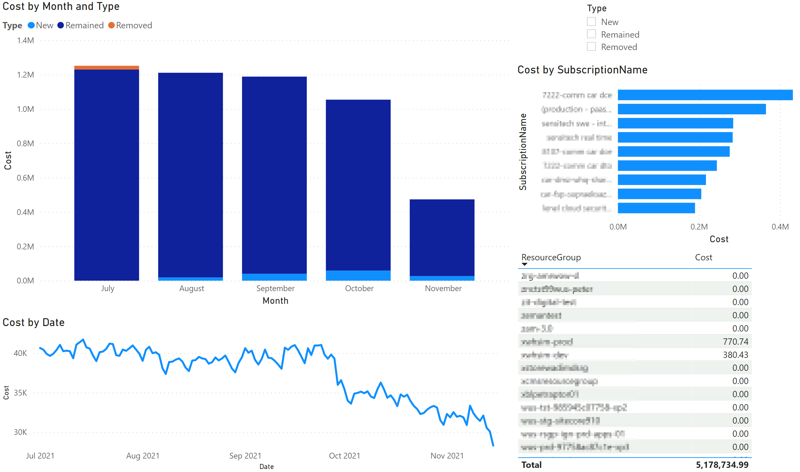

# Azure Billing Comparison to Point in Time


<!-- s -->

This reposistory demonstrates how to compare cost to a specific point in time (Baseline Date).

- First obtain your enrollment id and a valid api authentication key.
- Configure your environment
- Fetch and Filter the data
- Open the `/reports/PointInTimeAggregateLimitedColumns.pbit` template file

## Configure Environment

This section will configure you computer to run the scripts to fetch billing usage data.

- Copy Project to Local Computer
- Install Python
- Create and Activate a Python Virtual Environment
- Install Project

```bash
# Copy Project to local computer
cd /path/to/src/
git clone https://github.com/briglx/AzureBillingReports.git
cd /path/to/src/AzureBillingReports

# Check if you have python
# C:\Users\!Admin\AppData\Local\Programs\Python\Python310\python.exe --version
python --version
# Downloand and install from https://www.python.org/downloads/
# After installing python, navigate to the project folder
cd /path/to/src/AzureBillingReports

# Create Python Virtual Environment and activate
# C:\Users\!Admin\AppData\Local\Programs\Python\Python310\python.exe -m venv .venv
python -m venv .venv
.venv\Scripts\activate

# Install Project
python -m pip install --upgrade pip
python -m pip install -r requirements.txt
python -m pip install -e .

```

## Fetch and Filter Data

This section fetches and filters the billing usage data used in the report.

- Run the `get_usage_data.py` script to get the latest billing usage data. This will download and save the billing data into a csv file.
- Run the `filter_data.py` script to filter the usage data. This will filter out any data before the baseline date.

```bash
python script/get_usage_data.py --eid <enrollment_id> --auth_key <api_auth_key>
#a new file called usage-2021-11-11T14-19-09+00-00.csv will be created

python script/filter_data.py --path <path/to/csv> --min_date <2021-05-30>
#a new file called usage-2021-11-11T14-19-09+00-00.csv-filtered.csv will be created
```

## Open the Report

This is the report that uses the billing data to show a comparison to a specific point in time (Baseline Date).

- Open the `/reports/PointInTimeAggregateLimitedColumns.pbit` template file
- Provide the full path to the filtered downloaded csv file.
- Provide the Baseline Point in time path to the filtered downloaded csv file.
